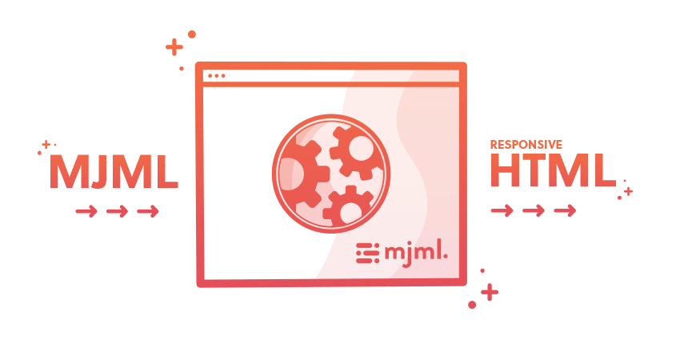
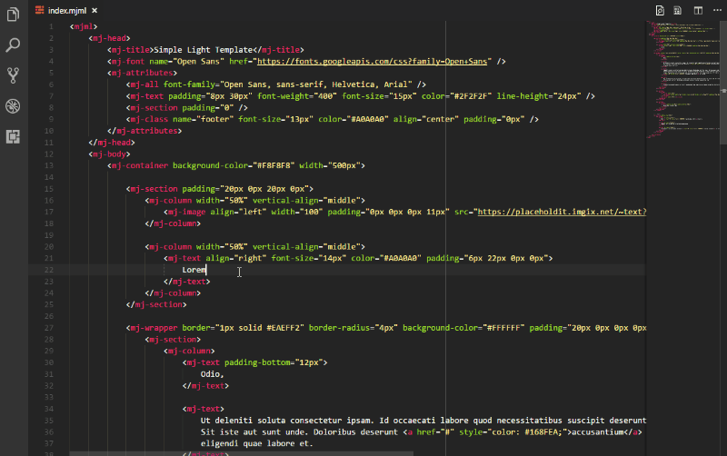

This post is a _beginner friendly_ guide to coding compliant, responsive, and attractive emails using [MJML](https://mjml.io/). I hope it can be of some use to someone!

Technology continues to improve, but it's accepted wisdom that writing (coding) email templates is still a painful developer experience, even as we close out the decade.

## Why?

I can't summarise the problem better than this introduction, from [campaignmonitor.com](https://www.campaignmonitor.com/dev-resources/guides/coding-html-emails/):

    "Unfortunately, while [the browser wars were] being fought, email clients like Outlook and Lotus Notes [...] were left behind.

    Even worse than not trying to improve their HTML and CSS rendering, some email clients have actually gone backwards. Three years ago, Microsoft decided Outlook 2007 would stop using Internet Explorer to render HTML emails. Before you get all excited, they were replacing it with Microsoft Word. Yes, that Microsoft Word, the word processor. In one version, Outlook went from being decent and understandable to downright terrible at displaying HTML emails from anyone except other Outlook users.

    Outlook 2007 is a hugely popular email client, but that’s not the only problem: building HTML for email means you’re dealing with more than four or five major web browsers, and 12 to 15 different email clients, each with solid market share.

    Some of them are great, like Apple Mail. A design that works in Safari will be perfect in Apple Mail. Some, like Outlook, are horrible and will cause dizziness, hair loss, and heart palpitations. In between are a whole slew of different rendering constraints, quirks, and inconsistencies."

If you scan over the rest of their (excellent) article, you'll see that -compared with making a regular web page- coding emails is still a **nightmare**.



## MJML

[Mailjet](https://www.mailjet.com/) are a "Paris-based, all-in-one Email Service Provider". Their business is email, and one of their services is a [WYSIWYG](https://en.wikipedia.org/wiki/WYSIWYG) editor for their non-technical clients to produce their emails. In the process of developing this editor, mailjet had to learn about all the horrible quirks mentioned above, and create a system to abtract that away. Wonderfully, they chose to open source the result, and that's [MJML](https://mjml.io/) | [source on github](https://github.com/mjmlio/mjml). (The focus of this tutorial.)

Their [intro tutorial](https://mjml.io/getting-started/1) is good, but I feel it assumes quite a bit, especially for beginners, so this tutorial is step by step, in an opinionated way. You can use their service in various ways. The following is what worked for me. I'm assuming, like me, that you'll come to this having already been provided a design by a client. My experience was, perhaps, not unusual, in that I was only given the full screen design- I was expected to infer how the mobile view should be implemented.

    I recommend scanning through the steps before beginning, as there are some things which may force a rethink, or even a redesign, and this way, you'll not waste the time you would if you followed along and then had to undo everything.

## Set up and installation

If you just want to see it in action, they have a nice "[try it live](https://mjml.io/try-it-live)" editor. That's great for testing syntax, but you're probably going to want to use your own images, so I recommend installing locally.

Install [Node](https://nodejs.org/en/) (if you don't already have it), then from the terminal/console:

```shell
npm install mjml
```

I use, and recommend the code editor [vscode](https://code.visualstudio.com/). It's free, really great, and there is a free extension for MJML, which you can get [here](https://marketplace.visualstudio.com/items?itemName=attilabuti.vscode-mjml) or find easily using vscode's extension search feature.
As you can see in the gif below, you create your mjml file and then you open a preview pane to the side, to show your output as you code:



## Key ideas

Your rows will be mjml **sections**. Within those you'll always have at least one mjml **column**, though if you have some stuff side by side on desktop, but that you want to stack on the responsive view, you'd have them each in their own column. Remember, you're bothering to learn this syntax so that the framework can render the complicated code necessary for your design to work well anywhere. This is the (relatively) painfree way.

```html
<mjml>
  <mj-body>
    <mj-section>
      <mj-column>
        <mj-text>Hello World!</mj-text>
      </mj-column>
    </mj-section>
  </mj-body>
</mjml>
```

Here's [an example](https://mjml.io/documentation/#2-columns-section) of the two column approach from the docs.

## Syntax

```css
/* in regular css: */
background-color:#ffffff;
color: white;
/* in mjml: */
background-color="#ffffff" color="white"
```

There are plenty of examples in [the docs](https://mjml.io/documentation/), but it's easy to get stuck simply because you're expecting your css to use a ":" and mjml wants a "=".

## Responsive and breakpoints

Unlike a regular web page, most email designs only have a single breakpoint, where the view changes from a mobile design to a desktop one. So there are only two designs required. As you'll see in [the docs](https://mjml.io/documentation/), you can set your breakpoint (where your columns will stack) in the mjml header:

```html
<mjml>
  <mj-head>
    <mj-breakpoint width="320px" />
  </mj-head>
  <mj-body>
    <mj-section>
      <mj-column>
        <mj-text>
          Hello World!
        </mj-text>
      </mj-column>
    </mj-section>
  </mj-body>
</mjml>
```

# Styles and custom classes

In the past, all email css was done _inline_, but that's not necessary here. Check the details [here](https://mjml.io/documentation/#mjml-style).

```html
<mjml>
  <mj-head>
    <mj-attributes>
      <mj-text padding="0" />
      <mj-class name="blue" color="blue" />
      <mj-class name="big" font-size="20px" />
      <mj-all font-family="Arial" />
    </mj-attributes>
  </mj-head>
  <mj-body>
    <mj-section>
      <mj-column>
        <mj-text mj-class="blue big">
          Hello World!
        </mj-text>
      </mj-column>
    </mj-section>
  </mj-body>
</mjml>
```

All your normal css logic applies; it's just a change of syntax.

## Generating the output HTML

Once you're more or less happy with your design, you'll want to actually convert this mjml file to html. Back in your terminal/console, navigate to the same directory (folder) as your mjml template file and run the following

```shell
mjml -r nameoftemplate.mjml -o nameofoutput.html
```

where nameoftemplate is whatever you saved your mjml as, and you are now naming the output as, nameofoutput.html.

If you then find the html file in your explorer you can open it in a browser and check the result. Running the same command again would overwrite the output, which is probably what you want if you've made improvements, but you could do

```shell
mjml -r nameoftemplate.mjml -o secondversion.html
```

if you'd made some, er, different version.

These instructions probably seem needlessly explicit, but most tutorials suffer more from skipping important steps rather than having too much.

## Final tweaks and client delivery

I had some issues with my design that I couldn't resolve with the templating engine. That's probably more a reflection of my inexperience than a problem with mjml. If you look at the output html file, you'll see everything has been converted to tables. This will be full of _if ie8..._ and similar code to deal with those nightmares for you. Don't be afraid to dive in and add any additional styling you made need to that output html. The hard stuff is done.

With that, you can compress the html and assets(images) into a zip and send it across to your client.

As I said at the start, I hope this can be of some use to someone. Let me know if something should be clarified or corrected.

Thanks for reading! :)
